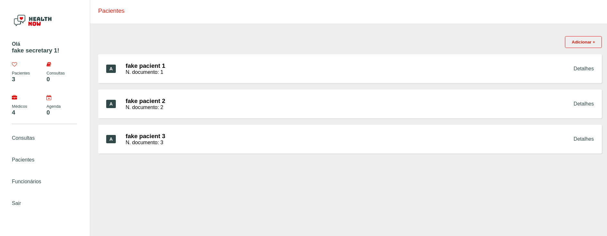

# helth Now 

O helth Now é uma aplicação web construida com Java JSP e Maven, para avaliação da Universidade Metodista de SP.

## Instalação

1. Clone o repositório: 
2. Acesse o diretório: cd helth-now
3. Instalar as dependencias
4. Executar o projeto com apache
5. Abrir o browser: http://localhost:PORT

## Login

A aplicação criar por padrão alguns usuários e conta com duas dasth diferentes uma para os funcionário e outra para o paciente segue abaixo os usuários:

 UserName  | Password
-----------|-----------
doctor101  | 123456e
secretary1 | 123456e
pacient1   | 123456p

## Screenshot

   
## Autor
Alexandre S. Soares
